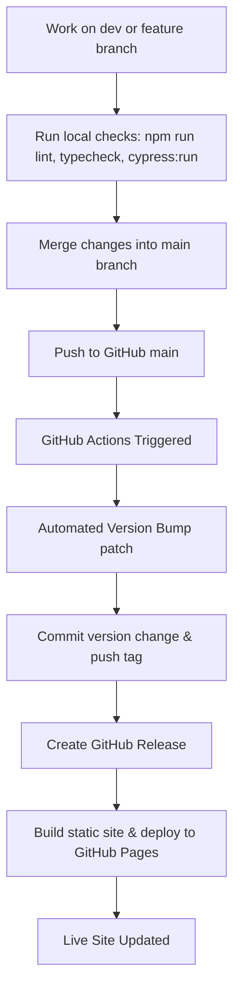

# MemoryLeak 📝

**MemoryLeak** is a modern, local-first Markdown editor designed for speed, privacy, and seamless synchronization. It operates offline-first using the browser's IndexedDB, features client-side AI support powered by Web-LLM (WebGPU), and implements manual Google Drive synchronization via client-side OAuth.

---

## 🚀 Key Features

- **Offline-First & Local-First:** Your data is stored locally in the browser's IndexedDB and `localStorage`. No mandatory cloud databases.
- **Client-Side LLM Support:** Leverages WebGPU/Web-LLM to run language models directly in your browser for smart suggestions and chat assistance.
- **Google Drive Sync:** Manual and secure synchronization of notes and folders using the client-side Google Drive API and OAuth 2.0.
- **Rich Markdown Editor:** Features live preview, LaTeX support (KaTeX), code block syntax highlighting, file drag-and-drop, and a sidebar navigation tree.
- **Clean Routing & PWA:** Seamless browser-history routing (fully compatible with single-page deployments like GitHub Pages) and PWA support.

---

## 🛠️ Day-to-Day Development Scripts

Below are the npm scripts available in the workspace to support your daily coding workflow:

| Command | Description |
|:---|:---|
| `npm run dev` | Launches the local development server (using Vite). |
| `npm run build` | Compiles TypeScript and builds the production-ready static assets to `dist/`. |
| `npm run preview` | Previews the production build locally. |
| `npm run lint` | Runs ESLint to check for code style issues and static analysis bugs. |
| `npm run format` | Runs Prettier to auto-format TypeScript/TSX source code. |
| `npm run typecheck` | Runs the TypeScript compiler in dry-run mode (`tsc --noEmit`) to verify type safety. |
| `npm run cypress:open` | Opens the interactive Cypress Test Runner UI for integration/E2E testing. |
| `npm run cypress:run` | Runs all Cypress integration/E2E tests headlessly. |

---

## 🔄 CI/CD & Deployment Flow

The project is configured with an automated release and deployment pipeline via **GitHub Actions** (`.github/workflows/deploy.yml`).

### Day-to-Day Deployment Flow



### CI/CD Workflow Steps
1. **Trigger:** The workflow runs automatically whenever a push is made to the `main` branch.
2. **Build Validation:** Installs npm dependencies (`npm ci`) and runs a validation build (`npm run build`).
3. **Automated Versioning:** 
   - Increments the patch version in `package.json` (e.g., from `0.0.1` to `0.0.2`).
   - Commits the version bump with `[skip ci]` in the message to prevent recursive workflow triggers.
   - Pushes the new commit and the corresponding version tag (e.g., `v0.0.2`) back to the `main` branch.
4. **GitHub Release:** Generates a new GitHub Release page for that tag with release details.
5. **Pages Deployment:** Re-builds the application with the new version and deploys the static files from `dist/` directly to GitHub Pages.

---

## ⚙️ Initial Project Configuration

To set up the project locally:
1. Clone the repository.
2. Copy `.env.example` to `.env` and fill in the required OAuth credentials and client IDs:
   ```bash
   cp .env.example .env
   ```
3. Install dependencies:
   ```bash
   npm install
   ```
4. Start the dev server:
   ```bash
   npm run dev
   ```

<!-- dev test commit -->
